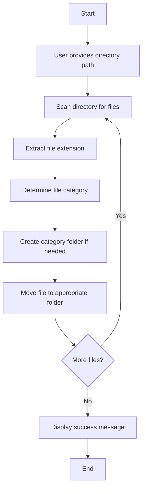

# 📂 File Organizer App

A console-based file management application developed in C that demonstrates Operating System file system concepts by automatically organizing files into categorized folders based on their extensions.


---

## 📌 Project Overview

The **File Organizer App** is an Operating Systems mini project that automates file organization by scanning a directory and sorting files into categorized folders based on their file extensions. This project provides hands-on experience with OS-level programming and file system management.

### ✨ Key Features

- 🔍 Automatic directory scanning
- 📁 Smart file categorization by extension
- 🚀 Efficient file system operations using OS system calls
- 🛠️ Cross-platform compatibility (Linux/macOS/WSL)
- 📊 Clean, organized folder structure generation

---

## 🎯 Objectives

- Understand **file system management** in operating systems
- Implement **directory traversal** using system calls
- Organize files automatically based on extensions
- Gain hands-on experience with **OS-level programming in C**

---

## 🧠 Operating System Concepts Demonstrated

| Concept | Implementation |
|---------|----------------|
| **File System Management** | Directory creation and file manipulation |
| **Directory Traversal** | Scanning and iterating through directory entries |
| **System Calls** | Low-level OS operations for file management |
| **File Metadata Handling** | Extracting and processing file properties |

---

## 🛠️ Technologies Used

- **Programming Language:** C
- **Compiler:** GCC
- **Operating System:** Linux / macOS / Windows Subsystem for Linux (WSL)

### 📚 Libraries Used

```c
#include <stdio.h>      // Standard I/O operations
#include <dirent.h>     // Directory operations
#include <string.h>     // String manipulation
#include <sys/stat.h>   // File statistics and directory creation
#include <stdlib.h>     // Standard library functions
```

---

## 📁 File Classification Logic

The application organizes files into the following categories:

| File Type | Extensions | Destination Folder |
|-----------|-----------|-------------------|
| 📄 **Documents** | `.txt`, `.pdf`, `.docx`, `.doc`, `.xlsx`, `.pptx` | `Documents/` |
| 🖼️ **Images** | `.jpg`, `.jpeg`, `.png`, `.gif`, `.bmp`, `.svg` | `Images/` |
| 🎵 **Audio** | `.mp3`, `.wav`, `.aac`, `.flac`, `.ogg` | `Audio/` |
| 🎥 **Videos** | `.mp4`, `.mkv`, `.avi`, `.mov`, `.wmv` | `Videos/` |
| 📦 **Others** | All other file types | `Others/` |

---

## ⚙️ How It Works



1. **Input:** User provides the directory path to organize
2. **Scanning:** Program scans all files in the specified directory
3. **Extraction:** File extensions are extracted using string operations
4. **Organization:** Required folders are created automatically
5. **Movement:** Files are moved into respective folders using OS system calls

---

## 🚀 Installation & Usage

### Prerequisites

- GCC compiler installed on your system
- Linux, macOS, or WSL environment

### Step 1: Clone the Repository

```bash
git clone https://github.com/HackHeroic/file_organizer.git
cd file_organizer
```

### Step 2: Compile the Program

```bash
gcc file_organizer.c -o organizer
```

Or use the provided Makefile (if available):

```bash
make
```

### Step 3: Run the Program

```bash
./organizer
```

### Step 4: Provide Input

When prompted, enter the directory path you want to organize:

```
Enter the directory path to organize: test_folder
```

### Example Output

**Before Organization:**
```
test_folder/
├── a.txt
├── b.png
├── c.jpg
├── audio.mp4
└── song.mp3
```

**After Organization:**
```
test_folder/
├── Documents/
│   └── a.txt
├── Images/
│   ├── b.png
│   └── c.jpg
├── Videos/
│   └── audio.mp4
├── Audio/
│   └── song.mp3
└── Others/
```

---

## 🌐 Next.js Web App (Frontend + Backend Connected)

A **Next.js** app in the `web/` folder connects the UI to backend logic so you can run scenarios from the browser and see **OS operations (system calls)** as they happen.

### Features

- **Scenarios:** Create directory + files, or organize an existing directory (same logic as the C program).
- **File System Explorer:** Browse the `workspace/` tree and delete files/folders.
- **Safe delete confirmation:** A popup appears **only when deleting a non-empty folder**.
- **Kernel Log (OS ops):** Lists every operation with its **system call** (e.g. `mkdir(2)`, `readdir(3)`, `rename(2)`) and paths.
- **Kernel Log tools:** Error-only toggle, Copy JSON, Clear.
- **Syscall “Explain” modal:** Click “Explain” on a log line to see what that syscall does (with C + Node examples).
- **Organize target picker:** Search + select an existing folder to organize.
- **Output panel:** Shows the result (created paths or organized folders and files).
- **Alice-style UI:** Subtle grid background and purple accent (inspired by [Alice](https://github.com/aryankeluskar/alice)).

All file operations are limited to the `web/workspace/` directory for safety.

### Run the Next.js app

```bash
make organizer_cli
cd web
npm install
npm run dev
```

Open [http://localhost:3000](http://localhost:3000). Run “Create directory + files”, then “Organize directory” (use the folder name you created) to see operations and output.

---

## 📖 Code Structure

```
file-organizer/
│
├── file_organizer.c        # C implementation (OS concepts)
├── organizer_cli.c         # C CLI (prints JSON) used by Next.js API
├── web/                    # Next.js app (connected frontend + API)
│   ├── app/
│   │   ├── api/scenario/   # create-dir, organize, list-workspace, delete
│   │   ├── components/     # FileExplorer, SyscallInfo, DeleteConfirmModal, Logo
│   │   ├── layout.js, page.js, globals.css
│   │   └── ...
│   ├── package.json
│   └── workspace/          # Safe directory for create/organize (gitignored)
├── frontend/               # Static HTML/JS visualization (uses output.json)
├── README.md
├── Makefile
└── test_folder/            # Sample directory for testing
```

---

## 🔍 Key Functions

| Function | Description |
|----------|-------------|
| `main()` | Entry point, handles user input and orchestrates organization |
| `getFileExtension()` | Extracts file extension from filename |
| `organizeFiles()` | Scans directory and moves files to appropriate folders |
| `createDirectory()` | Creates category folders if they don't exist |
| `moveFile()` | Moves files using system calls |

---

## 🧪 Testing

To test the application:

1. Create a test directory with sample files:
```bash
mkdir test_folder
cd test_folder
touch document.txt image.png song.mp3 video.mp4
cd ..
```

2. Run the organizer:
```bash
./organizer
```

3. Enter `test_folder` when prompted

4. Verify files are organized into proper folders

---

## 🌐 Running the Frontend

The frontend provides a visual representation of the organized files. To run it:

### Option 1: Using the Provided Script (Easiest)

```bash
./run_frontend.sh
```

Then open your browser and navigate to:
```
http://localhost:8000/frontend/index.html
```

### Option 2: Using Python HTTP Server

```bash
# From the project root directory
python3 -m http.server 8000
```

Then open: `http://localhost:8000/frontend/index.html`

### Option 3: Using Node.js (if installed)

```bash
npx http-server -p 8000
```

Then open: `http://localhost:8000/frontend/index.html`

### Option 4: Using PHP (if installed)

```bash
php -S localhost:8000
```

Then open: `http://localhost:8000/frontend/index.html`

**Note:** Make sure you've run the C program first to generate `output.json` before viewing the frontend.

---

## ❤️ Credits

Made with ❤️ by **C Murali Madhav** and **Ravi Yadav**.

## 🤝 Contributing

Contributions are welcome! Here's how you can help:

1. Fork the repository
2. Create a new branch (`git checkout -b feature/improvement`)
3. Make your changes
4. Commit your changes (`git commit -am 'Add new feature'`)
5. Push to the branch (`git push origin feature/improvement`)
6. Create a Pull Request

---

## 📝 Future Enhancements

- [ ] Add support for custom file categories
- [ ] Implement recursive subdirectory organization
- [ ] Add GUI interface
- [ ] Support for file size-based organization
- [ ] Undo functionality
- [ ] Configuration file for custom extensions
- [ ] Progress bar for large directories
- [ ] Duplicate file handling

---

