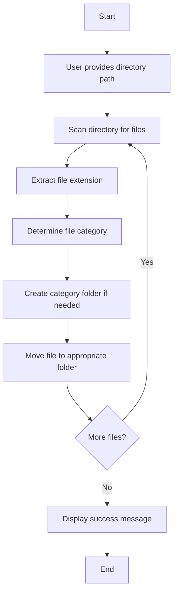

# 📂 File Organizer App

A full-stack file management application with a C backend demonstrating Operating System concepts, plus a Next.js web app with **AI-powered** natural language commands, semantic search, auto-tagging, and an autonomous organizing agent.


---

## 📌 Project Overview

The **File Organizer App** combines OS-level file operations (C + system calls) with an AI-powered web interface. Scan directories, organize by extension, run natural language commands (“Move all PDFs into Taxes”, “Find the budget spreadsheet”), use semantic search, get AI-suggested tags and comments, and let an autonomous agent plan and execute multi-step organization—all within a safe `workspace/` sandbox.

### ✨ Key Features

- 🔍 **Automatic directory scanning** – C program + Node.js fallback
- 📁 **Smart file categorization** by extension (Documents, Images, Audio, Videos, Others)
- 🚀 **OS system calls** – mkdir, readdir, rename, unlink, stat
- 🤖 **Natural language commands** – “Organize my Downloads”, “Find duplicates”, “List everything”
- 🧠 **Semantic search** – Search inside PDFs, images (vision), and text by meaning
- 🏷️ **AI auto-tagging** – Suggest tags from filename + content; user approves, saved to meta
- 💬 **AI suggest comment** – Summarise/extract descriptions for PDFs, images, text files
- 🎯 **Autonomous agent** – Plan multi-step goals; user confirms; execute create-folder, move, delete
- 🔒 **Human in the loop** – Destructive actions require confirmation; logs and undo where possible

---

## 🎯 Objectives

- Understand **file system management** in operating systems
- Implement **directory traversal** using system calls
- Organize files automatically based on extensions
- Gain hands-on experience with **OS-level programming in C**
- Integrate **AI** for natural language control, semantic search, and autonomous organization

---

## 🤖 AI Feature Tiers (Roadmap & Status)

| Tier | Status | Description |
|------|--------|-------------|
| **Tier 1** | ✅ Implemented | NL commands + rules (no heavy ML) |
| **Tier 2** | ✅ Implemented | Smart organisation, semantic search, auto-tagging |
| **Tier 3** | ✅ Implemented | Autonomous agent with plan → confirm → execute |
| **Tier 4** | 🚧 Work in progress | Document understanding, summarise/extract, auto-filing by content |

### Tier 1 – Natural language + rules ✅

- **NL commands:** “Move all PDFs from last week into Taxes”, “Find duplicates”, “List everything I haven’t opened in 6 months.” Intent parsed via LLM → calls existing APIs (list, move, delete, search).
- **Simple agent loop:** User says “organise my Downloads” → agent lists folder → suggests categories → user confirms → agent runs create-folder + move.
- **Scope:** Chat/command bar translates sentences into file operations. No S3; works with current backend.

### Tier 2 – Smarter organisation and search ✅

- **Auto-tagging:** LLM suggests tags from filenames + content (PDF/text); user approves; saved to `.file-organizer-meta.json`.
- **Semantic search:** “Find the budget spreadsheet” without exact name — embeds filenames, PDF text, image content (vision); searches by meaning.
- **Smart suggestions:** “These look like duplicates”, “These could go in a ‘Projects’ folder.” Agent suggests; user confirms.
- **Scope:** Human in the loop; AI suggests, app performs. Local storage only.

### Tier 3 – Autonomous agent ✅

- **Goals:** “Keep my workspace organised”, “Archive old stuff monthly.” Agent plans steps and executes on confirm.
- **Tool use:** list, create_folder, move, delete. Agent plans steps, calls APIs.
- **Safety:** Destructive (move, delete) require confirmation; logs and undo where possible.
- **Scope:** Multi-step agent with clear boundaries.

### Tier 4 – Document understanding 🚧

- **Summarise / extract:** “What’s in this PDF?” — AI suggest comment generates descriptive summaries for PDFs, images, text. Content analysis extracts PDF text, reads text files, passes images to vision API.
- **Auto-filing by content:** Semantic search + organize use document content to suggest folders. “Put all receipts in Receipts by month” — foundation in place; rule-based auto-filing by document type is work in progress.
- **Scope:** Depends on document types (PDF, images, etc.); uses Gemini API. Storage stays local.
- **Planned:** Full implementation of “List all invoices from these folders”, content-based auto-filing rules, and deeper integration with the agent for document-aware organisation.

---

## 🧠 Operating System Concepts Demonstrated

| Concept | System calls / APIs | Where used |
|---------|---------------------|------------|
| **File System Management** | `mkdir(2)`, directory creation | Create folder, organize, C CLI |
| **Directory Traversal** | `opendir(3)` / `readdir(3)` (getdents) | List workspace, organize, file manager |
| **File creation / write** | `open(2)` / `write(2)` / `close(2)` | Upload, create files |
| **File move / rename** | `rename(2)` | Organize by extension, rename in file manager |
| **File delete** | `unlink(2)` | Delete file in file manager |
| **Directory delete** | `rmdir(2)` / `unlinkat(2)` | Delete folder (recursive) |
| **File metadata** | `stat(2)` | List (size, mtime), view document |
| **File read** | `read(2)` | View document, download |

---

## 🛠️ Technologies Used

- **Backend (OS):** C, GCC, system calls (Linux/macOS/WSL)
- **Web:** Next.js, React, Node.js `fs`
- **AI:** Google Gemini API (Gemini 2.0 Flash / 1.5 Flash fallback)
- **Document handling:** pdf-parse, vision (images) via Gemini

### 📚 C libraries (file_organizer.c)

```c
#include <stdio.h>      // Standard I/O operations
#include <dirent.h>     // Directory operations
#include <string.h>     // String manipulation
#include <sys/stat.h>   // File statistics and directory creation
#include <stdlib.h>     // Standard library functions
```

---

## 📁 File Classification Logic

The application organizes files into the following categories:

| File Type | Extensions | Destination Folder |
|-----------|-----------|-------------------|
| 📄 **Documents** | `.txt`, `.pdf`, `.docx`, `.doc`, `.xlsx`, `.pptx` | `Documents/` |
| 🖼️ **Images** | `.jpg`, `.jpeg`, `.png`, `.gif`, `.bmp`, `.svg` | `Images/` |
| 🎵 **Audio** | `.mp3`, `.wav`, `.aac`, `.flac`, `.ogg` | `Audio/` |
| 🎥 **Videos** | `.mp4`, `.mkv`, `.avi`, `.mov`, `.wmv` | `Videos/` |
| 📦 **Others** | All other file types | `Others/` |

---

## ⚙️ How It Works



1. **Input:** User provides the directory path to organize
2. **Scanning:** Program scans all files in the specified directory
3. **Extraction:** File extensions are extracted using string operations
4. **Organization:** Required folders are created automatically
5. **Movement:** Files are moved into respective folders using OS system calls

---

## 🚀 Installation & Usage

### Prerequisites

- GCC compiler installed on your system
- Linux, macOS, or WSL environment

### Step 1: Clone the Repository

```bash
git clone https://github.com/HackHeroic/file_organizer.git
cd file_organizer
```

### Step 2: Compile the Program

```bash
gcc file_organizer.c -o organizer
```

Or use the provided Makefile (if available):

```bash
make
```

### Step 3: Run the Program

```bash
./organizer
```

### Step 4: Provide Input

When prompted, enter the directory path you want to organize:

```
Enter the directory path to organize: test_folder
```

### Example Output

**Before Organization:**
```
test_folder/
├── a.txt
├── b.png
├── c.jpg
├── audio.mp4
└── song.mp3
```

**After Organization:**
```
test_folder/
├── Documents/
│   └── a.txt
├── Images/
│   ├── b.png
│   └── c.jpg
├── Videos/
│   └── audio.mp4
├── Audio/
│   └── song.mp3
└── Others/
```

---

## 🌐 Next.js Web App (Frontend + Backend Connected)

A **Next.js** app in the `web/` folder connects the UI to backend logic so you can run scenarios from the browser, see **OS operations (system calls)**, and use **AI features** (commands, semantic search, agent).

### Features

**OS scenarios & file management**
- **Scenarios:** Create directory + files, or organize an existing directory (same logic as the C program).
- **File System Explorer:** Browse the `workspace/` tree and delete files/folders.
- **Safe delete confirmation:** A popup appears **only when deleting a non-empty folder**.
- **Kernel Log (OS ops):** Lists every operation with its **system call** (e.g. `mkdir(2)`, `readdir(3)`, `rename(2)`) and paths.
- **Kernel Log tools:** Error-only toggle, Copy JSON, Clear.
- **Syscall “Explain” modal:** Click “Explain” on a log line to see what that syscall does (with C + Node examples).
- **Organize target picker:** Search + select an existing folder to organize.
- **Output panel:** Shows the result (created paths or organized folders and files).

**AI features (require `GOOGLE_API_KEY`)**
- **Natural language command bar:** Type “list files”, “create folder Projects”, “organize images”, “find the budget spreadsheet”, “get info on doc.pdf”, etc.
- **Semantic search:** Searches inside PDFs, text files, and images (vision) by meaning.
- **AI suggest tags:** Per-file “Suggest tags (AI)” in the info panel; tags saved to meta.
- **AI suggest comment:** Per-file “Suggest comment (AI)” for PDFs, images, text; generates descriptions.
- **Agent goals:** Enter a goal (e.g. “organise my Downloads”), agent plans steps, you confirm, then execute.

**UI**
- **Alice-style UI:** Subtle grid background and purple accent (inspired by [Alice](https://github.com/aryankeluskar/alice)).

All file operations are limited to the `web/workspace/` directory for safety.

**Where are uploaded files (e.g. PDFs) stored?**  
Uploaded files are stored on the **server filesystem** only: in the `web/workspace/` directory (or in a subfolder if you uploaded from inside a folder). There is no database or cloud storage—the app uses the OS filesystem (Node.js `fs` APIs, and the C backend when using the organizer CLI). You can see **Storage** (used space and location) in the File Manager sidebar.

### Run the Next.js app

```bash
make organizer_cli
cd web
npm install
```

**Optional – enable AI features:** Copy `web/.env.example` to `web/.env.local` and add your Google AI API key:

```
GOOGLE_API_KEY=your_gemini_api_key
```

Then:

```bash
npm run dev
```

Open [http://localhost:3000](http://localhost:3000). Run “Create directory + files”, then “Organize directory”. In the File Manager tab, try the AI command bar (“organise images”, “find PDFs about taxes”) and agent goals.

---

## 📖 Code Structure

```
file-organizer/
│
├── file_organizer.c        # C implementation (OS concepts)
├── organizer_cli.c         # C CLI (prints JSON) used by Next.js API
├── web/                    # Next.js app (connected frontend + API)
│   ├── app/
│   │   ├── api/
│   │   │   ├── scenario/        # create-dir, organize, list-workspace, delete
│   │   │   └── file-manager/    # list, delete, rename, upload, meta, search, ...
│   │   │       ├── ai-command/      # NL commands → action execution
│   │   │       ├── ai-agent/        # Goal → plan → execute
│   │   │       ├── ai-suggest-tags/ # Tag suggestions from content
│   │   │       ├── ai-suggest-comment/ # Summary/comment for docs
│   │   │       └── lib/
│   │   │           ├── content-analysis.js  # PDF/text/image extraction
│   │   │           └── execute-action.js    # list, move, delete, etc.
│   │   ├── components/     # FileExplorer, FileManager, SyscallInfo, FileInfoPanel, ...
│   │   ├── layout.js, page.js, globals.css
│   │   └── ...
│   ├── package.json
│   └── workspace/          # Safe directory for create/organize (gitignored)
├── frontend/               # Static HTML/JS visualization (uses output.json)
├── README.md
├── Makefile
└── test_folder/            # Sample directory for testing
```

### AI command actions (parsed from natural language)

| Action | Params | Example command |
|--------|--------|-----------------|
| `list` | `{}` | “List files”, “Show what’s here” |
| `create_folder` | `{name}` | “Create folder Projects” |
| `move` | `{from, to}` | “Move doc.pdf to Taxes” |
| `copy` | `{from, to}` | “Copy file.txt to Backup” |
| `delete` | `{path}` | “Delete old.pdf” |
| `rename` | `{path, newName}` | “Rename x.txt to y.txt” |
| `info` | `{path}` | “Get info on report.pdf” |
| `search` | `{query}` | “Search for budget” (keyword) |
| `semantic_search` | `{query}` | “Find the budget spreadsheet” |
| `suggest` | `{}` | “Suggest organisation” (no execute) |
| `organize` | `{type?}` | “Organize images”, “Organize files” |

---

## 🔍 Key Functions

**C (file_organizer.c / organizer_cli.c)**
| Function | Description |
|----------|-------------|
| `main()` | Entry point, handles user input and orchestrates organization |
| `getFileExtension()` | Extracts file extension from filename |
| `organizeFiles()` | Scans directory and moves files to appropriate folders |
| `createDirectory()` | Creates category folders if they don't exist |
| `moveFile()` | Moves files using system calls |

**Web / AI**
| Component | Description |
|-----------|-------------|
| `ai-command/route.js` | Parses NL intent → action (list, move, search, organize, etc.) |
| `ai-agent/route.js` | Goal → plan steps → execute (with confirm) |
| `ai-suggest-tags`, `ai-suggest-comment` | LLM suggests tags/comments; stored in meta |
| `content-analysis.js` | `getFileContentInfo` — extracts PDF text, reads text files, image base64 for vision |
| `semanticMatch()` | Searches file content by meaning (PDF, text, images) |

---

## 🧪 Testing

To test the application:

1. Create a test directory with sample files:
```bash
mkdir test_folder
cd test_folder
touch document.txt image.png song.mp3 video.mp4
cd ..
```

2. Run the organizer:
```bash
./organizer
```

3. Enter `test_folder` when prompted

4. Verify files are organized into proper folders

---

## 🌐 Running the Frontend

The frontend provides a visual representation of the organized files. To run it:

### Option 1: Using the Provided Script (Easiest)

```bash
./run_frontend.sh
```

Then open your browser and navigate to:
```
http://localhost:8000/frontend/index.html
```

### Option 2: Using Python HTTP Server

```bash
# From the project root directory
python3 -m http.server 8000
```

Then open: `http://localhost:8000/frontend/index.html`

### Option 3: Using Node.js (if installed)

```bash
npx http-server -p 8000
```

Then open: `http://localhost:8000/frontend/index.html`

### Option 4: Using PHP (if installed)

```bash
php -S localhost:8000
```

Then open: `http://localhost:8000/frontend/index.html`

**Note:** Make sure you've run the C program first to generate `output.json` before viewing the frontend.

---

## ❤️ Credits

Made with ❤️ by **C Murali Madhav** and **Ravi Yadav**.

## 🤝 Contributing

Contributions are welcome! Here's how you can help:

1. Fork the repository
2. Create a new branch (`git checkout -b feature/improvement`)
3. Make your changes
4. Commit your changes (`git commit -am 'Add new feature'`)
5. Push to the branch (`git push origin feature/improvement`)
6. Create a Pull Request

---

## 📝 Future Enhancements

**Tier 4 completion**
- [ ] Full document extraction: “List all invoices from these folders”
- [ ] Auto-filing rules: “Put all receipts in Receipts by month”
- [ ] Batch document summaries across folders

**Tier 3 extension**
- [ ] Periodic/triggered agent: “Keep my workspace organised” runs on schedule or after upload
- [ ] Expanded agent tools: copy, rename, search from within agent plan

**General**
- [ ] Custom file categories (config file)
- [ ] Undo functionality for move/delete
- [ ] Progress bar for large directories

---

